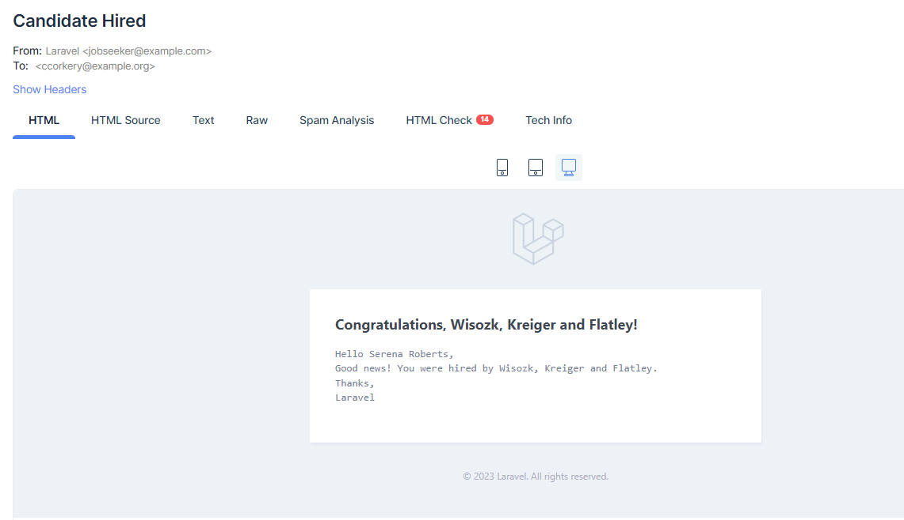
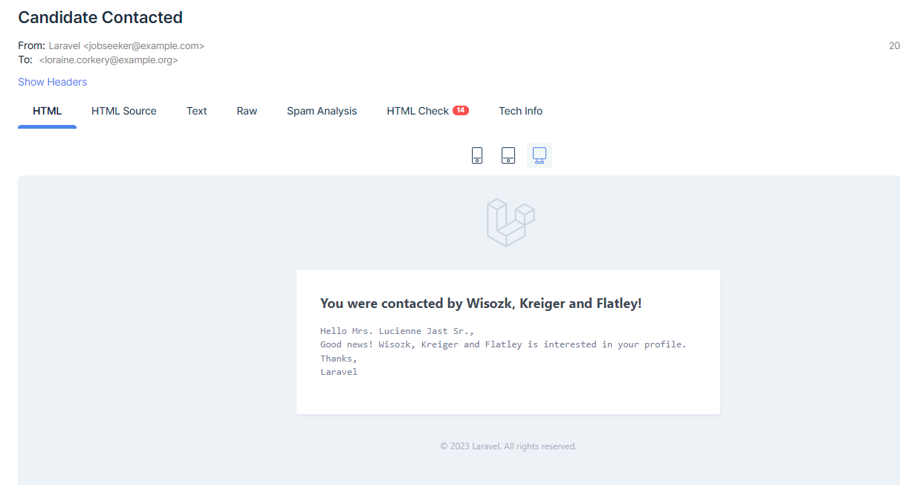

# Hiring platform for job seekers
### Small jobseeker application

## Setup
1. Clone the repo
2. In the root folder of the repo, run `docker-compose up -d`
3. Enter the PHP container `docker exec -it php sh`
4. Run `composer install`
5. Run `php artisan migrate`
6. Run `php artisan db:seed`

## Env
1. copy `.env.example` to new file `.env`
2. Setup a mailtrap account and required `MAIL_FROM_ADDRESS` env var

## Run application
Application is accessible under `http://localhost:8080/`

## Email examples
For hiring a candidate

For contacting a candidate

